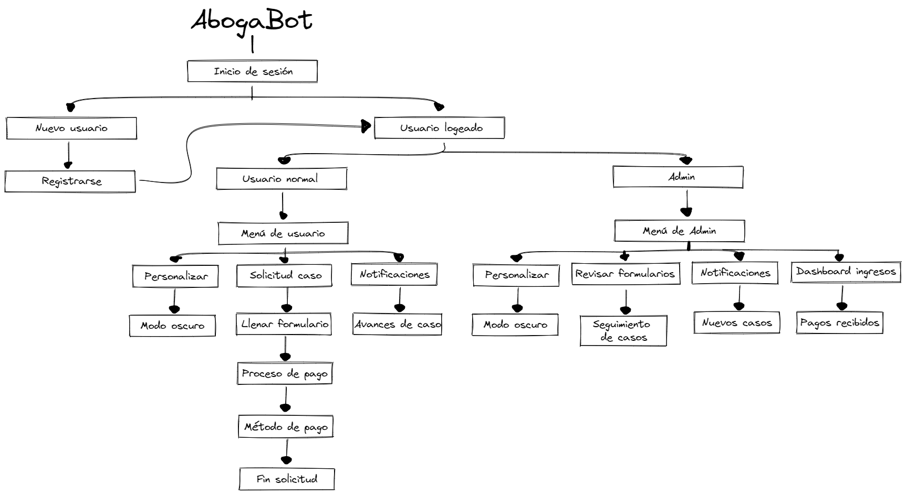

# AbogaBot

Aplicación móvil y web que tiene como finalidad automatizar las demandas mediante formularios, de los clientes
del despacho de abogados _**Mazo de abogados**_

---

## 1. Toma de requerimientos

El cliente solicita una página web en la que el usuario pueda registarse e iniciar sesión para poder llenar una solicitud mediante un formulario, el cual automatizará de mejor manera las demandas del usuario. Al final de realizar la solicitud el cliente pasará a la sección de pago, en donde seleccionará el método de pago de su conveniencia. Posteriormente el usuario recibirá en su bandeja de notificaciones actualizaciones y comentarios acerca de su demanda.

El administrador recibirá las demandas en la bandeja de notificaciones, en donde podrá darle seguimiento a cada uno de los usuarios solicitantes para darles actualizaciones de su caso y/o comentarios. Además contará con una seccion _Dashboard_ el cual servirá para recibir los pagos de sus usarios

### Diagrama de flujo

